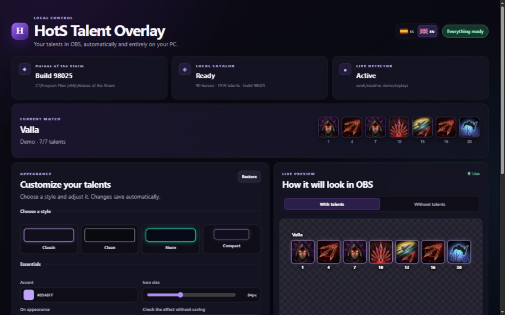
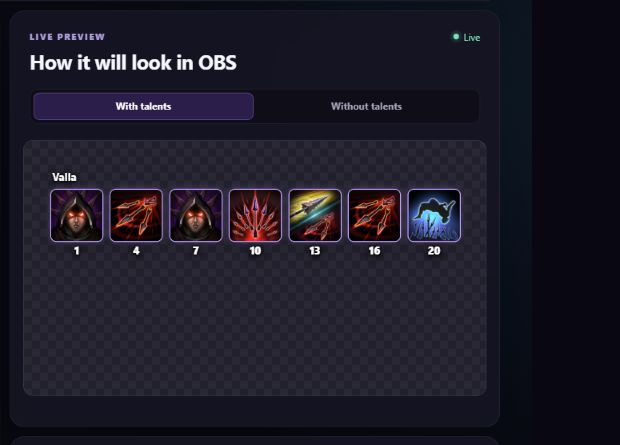

# HotS Talent Overlay

**English** · [Español](#español)

Windows app · OBS Browser Source · Local match data

Show your *Heroes of the Storm* talent choices on stream, with the real in-game icons. Set it up once, add a Browser Source to OBS, and let the app follow your matches.

[Download the Windows installer](https://github.com/Chikedor/HotSTalentOverlay/releases/latest) · [Get started](#quick-start) · [See the Spanish guide](#español)



*The dashboard, showing a demo match. No personal account or match data is shown in this screenshot.*

### What you get

| In OBS | In the dashboard | Behind the scenes |
| --- | --- | --- |
| Hero and talent icons update as HotS saves the match | Live preview, appearance controls, English/Spanish UI | Reads local game files; no game injection or telemetry |

- Runs entirely on your Windows PC after setup.
- Automatically detects the installed HotS build.
- Extracts hero, talent, and icon data directly from the local CASC game files.
- Regenerates the catalog when the game build changes.
- Updates OBS live through Server-Sent Events—no browser polling or manual refresh.
- Provides a complete dashboard in English and Spanish.
- Checks GitHub for new releases and updates itself with one click from the dashboard.
- Lets you personalize colors, borders, spacing, labels, and animations with a live preview.
- Never uploads your BattleTag, matches, or talent choices.

## Quick start

### Windows installer (recommended)

1. Download `HotSTalentOverlay-Setup.exe` from the [latest release](https://github.com/Chikedor/HotSTalentOverlay/releases/latest).
2. Click **Install** and then **Open**.
3. Follow the one-minute setup assistant to detect HotS and add the Browser Source to OBS.

The installer adds Start menu and optional desktop/startup shortcuts. The app runs from the Windows tray and opens the dashboard automatically. No separate .NET installation is required. The portable ZIP remains available for users who prefer it.

When a new release is available, the dashboard displays **New version available — Update and restart**. The app downloads the official GitHub installer, updates in place, and reopens automatically without deleting your settings.

### Build from source

Open PowerShell in the repository and run:

```powershell
Set-ExecutionPolicy -Scope Process Bypass
.\setup.ps1
```

The script downloads a repository-local .NET SDK and `HeroesDataParser`, restores dependencies, runs the test suite, and publishes the app. It does not modify HotS or install a Windows service.

## Add the overlay to OBS

1. Add a **Browser Source** in OBS.
2. Set the URL to `http://127.0.0.1:3874/overlay.html`.
3. Use a width of `1920` and height of `1080`.
4. Optionally enable **Shutdown source when not visible**.

Use the **With talents / Without talents** preview switch to test both overlay states without changing OBS.



*What the overlay looks like with seven talents selected. The checkerboard represents transparency in OBS.*

## Customize the overlay

Open the dashboard and use **Appearance** to tailor the overlay without editing CSS:

- Choose the accent, empty-border, background, and text colors.
- Adjust the icon size, spacing, border width, radius, and style.
- Select how a new talent appears: fade, slide, pop, flip, or no animation.
- Replay the selected appearance animation directly in the preview before saving.
- Smoothly clears the previous talents when a new match is detected.
- Show or hide the hero name, talent levels, and localized talent names.
- Show unselected talent slots or hide them while keeping their space reserved.
- Preview every change instantly; it is saved automatically for OBS and future sessions.

Use the Spanish and British flag buttons to change the dashboard language. **Talent language** controls the game data extracted from HotS and is intentionally configured separately.

## Player identification

The app normally identifies the local player from the account identifier in the `StormSave` path. If that is not possible, enter a BattleTag such as `Player#1234` under **Configuration** and save it.

## Local data and privacy

Runtime data stays under `%LOCALAPPDATA%\HotSTalentOverlay`:

```text
config.json
data/talents.json
assets/talents/
logs/latest.log
```

The web server only binds to `127.0.0.1` by default. Match and account data are not uploaded. There is no telemetry; the update feature contacts GitHub only to check releases and download an update when you choose to install it.

## Troubleshooting

- **HotS not detected:** select the game directory containing `.build.info`.
- **Player not identified:** configure your BattleTag and check the Accounts directory.
- **Extraction error:** inspect `logs/latest.log`. A failed regeneration keeps the previous working catalog.
- **Parser/extractor incompatibility:** the dashboard reports the error instead of silently discarding it.
- **Port changed:** restart the application and update the OBS URL.

## Known limitation: update delay

HotS decides when it writes live match state to `StormSave`. In testing, writes usually happen around every 90 seconds, so a newly selected talent can take roughly 90–120 seconds to appear. HotSTalentOverlay processes the file immediately after it changes, but it cannot reliably detect a choice before the game persists it. The project deliberately avoids process injection, memory reading, keyboard hooks, and resolution-dependent screen recognition.

## Credits and third-party work

HotSTalentOverlay builds on excellent open-source work by other developers:

- [HeroesDataParser](https://github.com/HeroesToolChest/HeroesDataParser) 5.0.4, created by **Kevin Oliva and contributors** (MIT), reads the local CASC installation and extracts hero metadata and talent icons.
- [Heroes.StormReplayParser](https://github.com/HeroesToolChest/Heroes.StormReplayParser) 2.2.1, created by **Kevin Oliva and contributors** (MIT), provides the replay and tracker-event decoding. This repository vendors a small, documented compatibility adaptation for current `StormSave` files.
- [Heroes.MpqTool](https://github.com/HeroesToolChest/Heroes.MpqTool) 1.2.0, created by **Kevin Oliva and contributors** (MIT), is used transitively to read Blizzard MPQ containers.
- [.NET and ASP.NET Core](https://github.com/dotnet) by **Microsoft and .NET contributors** (MIT) provide the application runtime and local web server.
- [xUnit.net](https://github.com/xunit/xunit) v3 by **James Newkirk, Brad Wilson, and contributors** (Apache-2.0) provides the test framework.

The [Heroes Profile Uploader](https://github.com/Heroes-Profile/HeroesProfile.Uploader) was used as an architectural reference for resilient `StormSave` watching, but none of its source code or services are included.

Thank you to every maintainer and contributor behind these projects. Full version, copyright, and license notices are in [`THIRD_PARTY_NOTICES.md`](THIRD_PARTY_NOTICES.md).

*Heroes of the Storm* and its assets are property of Blizzard Entertainment. HotSTalentOverlay is an independent community project and is not affiliated with or endorsed by Blizzard Entertainment.

## Development

```powershell
.\setup.ps1 -SkipPublish
$env:HOTS_STORMSAVE_FIXTURE='C:\path\to\fixture.StormSave'
.\.dotnet\dotnet.exe test HotSTalentOverlay.slnx --configuration Release
```

The project is licensed under MIT. The vendored HeroesToolChest dependency is also MIT; see `THIRD_PARTY_NOTICES.md` for details.

---

## Español

Muestra tus talentos de *Heroes of the Storm* en directo con los iconos reales del juego. Configúralo una vez, añade una fuente Navegador en OBS y deja que la aplicación siga tus partidas.

[Descargar el instalador para Windows](https://github.com/Chikedor/HotSTalentOverlay/releases/latest) · [Empezar](#inicio-rápido) · [English](#hots-talent-overlay)


*Panel con una partida de demostración. La captura no contiene datos personales ni partidas reales.*

### De un vistazo

| En OBS | En el panel | En segundo plano |
| --- | --- | --- |
| Héroe e iconos de talentos actualizados cuando HotS guarda la partida | Vista previa, personalización e interfaz en español/inglés | Lee archivos locales del juego; sin inyección ni telemetría |

- Funciona íntegramente en tu PC con Windows después de prepararlo.
- Detecta automáticamente la build instalada de HotS.
- Extrae héroes, talentos e iconos directamente de los archivos CASC locales.
- Regenera el catálogo cuando cambia la build del juego.
- Actualiza OBS mediante Server-Sent Events, sin polling ni recargas manuales.
- Ofrece un panel completo en español e inglés.
- Comprueba si hay nuevas versiones en GitHub y se actualiza con un clic desde el panel.
- Permite personalizar colores, bordes, espaciado, textos y animaciones con vista previa en directo.
- Nunca sube tu BattleTag, partidas o elecciones de talentos.

## Inicio rápido

### Instalador para Windows (recomendado)

1. Descarga `HotSTalentOverlay-Setup.exe` desde la [última versión](https://github.com/Chikedor/HotSTalentOverlay/releases/latest).
2. Pulsa **Instalar** y después **Abrir**.
3. Sigue el asistente de un minuto para detectar HotS y añadir la fuente Navegador a OBS.

El instalador añade accesos directos al menú Inicio y, opcionalmente, al escritorio y al inicio de Windows. La aplicación vive en la bandeja del sistema y abre el panel automáticamente. No requiere instalar .NET. El ZIP portátil continúa disponible para quien lo prefiera.

Cuando existe una nueva versión, el panel muestra **Nueva versión disponible — Actualizar y reiniciar**. La aplicación descarga el instalador oficial de GitHub, se actualiza sobre la instalación existente y vuelve a abrirse sin borrar tu configuración.

### Compilar desde el código fuente

Abre PowerShell en el repositorio y ejecuta:

```powershell
Set-ExecutionPolicy -Scope Process Bypass
.\setup.ps1
```

El script descarga una copia local de .NET y `HeroesDataParser`, restaura las dependencias, ejecuta los tests y publica la aplicación. No modifica HotS ni instala ningún servicio de Windows.

## Añadir el overlay a OBS

1. Añade una fuente **Navegador** en OBS.
2. Usa la URL `http://127.0.0.1:3874/overlay.html`.
3. Configura un ancho de `1920` y un alto de `1080`.
4. Opcionalmente, activa **Cerrar fuente cuando no sea visible**.

Usa el selector **Con talentos / Sin talentos** para probar ambos estados sin modificar OBS.


*Así se ve el overlay con siete talentos elegidos. El fondo de cuadros representa la transparencia en OBS.*

## Personalizar el overlay

Abre el panel y usa **Apariencia** para adaptar el overlay sin editar CSS:

- Elige los colores de acento, borde vacío, fondo y texto.
- Ajusta el tamaño y la separación de los iconos, además del grosor, radio y estilo del borde.
- Selecciona cómo aparece un nuevo talento: fundido, deslizamiento, pop, giro o sin animación.
- Reproduce la animación de aparición elegida directamente en la vista previa; los cambios se guardan automáticamente.
- Vacía suavemente los talentos anteriores cuando detecta una partida nueva.
- Muestra u oculta el nombre del héroe, los niveles y los nombres localizados de los talentos.
- Muestra los huecos de talentos sin elegir u ocúltalos manteniendo reservado su espacio.
- Previsualiza cada cambio al instante y guárdalo para OBS y las próximas sesiones.

Usa los botones con las banderas española y británica para cambiar el idioma del panel. **Idioma de talentos** controla los datos del juego extraídos de HotS y se configura por separado de forma intencionada.

## Identificación del jugador

Normalmente la aplicación identifica al jugador local mediante el identificador de cuenta incluido en la ruta del `StormSave`. Si no fuera posible, escribe un BattleTag como `Jugador#1234` en **Configuración** y guárdalo.

## Datos locales y privacidad

Los datos de ejecución permanecen en `%LOCALAPPDATA%\HotSTalentOverlay`:

```text
config.json
data/talents.json
assets/talents/
logs/latest.log
```

El servidor web solo escucha en `127.0.0.1` de forma predeterminada. No se suben datos de partidas ni de la cuenta. No hay telemetría; la función de actualización contacta con GitHub únicamente para comprobar versiones y descargar una actualización cuando eliges instalarla.

## Diagnóstico

- **HotS no detectado:** selecciona la carpeta del juego que contiene `.build.info`.
- **No se identifica al jugador:** configura tu BattleTag y comprueba la carpeta Accounts.
- **Error de extracción:** revisa `logs/latest.log`. Si una regeneración falla, se conserva el último catálogo funcional.
- **Parser o extractor incompatible:** el panel muestra el error en lugar de ignorarlo silenciosamente.
- **Puerto modificado:** reinicia la aplicación y actualiza la URL de OBS.

## Limitación conocida: retraso de actualización

HotS decide cuándo escribe el estado de la partida en `StormSave`. En las pruebas, las escrituras suelen producirse aproximadamente cada 90 segundos, por lo que un talento recién elegido puede tardar unos 90–120 segundos en aparecer. HotSTalentOverlay procesa el archivo inmediatamente después del cambio, pero no puede conocer la elección de forma fiable antes de que el juego la guarde. El proyecto evita deliberadamente la inyección en el proceso, la lectura de memoria, los hooks de teclado y el reconocimiento de pantalla dependiente de la resolución.

## Créditos y trabajo de terceros

HotSTalentOverlay se apoya en el excelente trabajo open source de otros desarrolladores:

- [HeroesDataParser](https://github.com/HeroesToolChest/HeroesDataParser) 5.0.4, creado por **Kevin Oliva y colaboradores** (MIT), lee la instalación CASC local y extrae los metadatos de héroes y los iconos de talentos.
- [Heroes.StormReplayParser](https://github.com/HeroesToolChest/Heroes.StormReplayParser) 2.2.1, creado por **Kevin Oliva y colaboradores** (MIT), proporciona la decodificación de replays y eventos del tracker. Este repositorio incluye una pequeña adaptación de compatibilidad documentada para los `StormSave` actuales.
- [Heroes.MpqTool](https://github.com/HeroesToolChest/Heroes.MpqTool) 1.2.0, creado por **Kevin Oliva y colaboradores** (MIT), se utiliza de forma transitiva para leer los contenedores MPQ de Blizzard.
- [.NET y ASP.NET Core](https://github.com/dotnet) de **Microsoft y los colaboradores de .NET** (MIT) proporcionan el runtime y el servidor web local.
- [xUnit.net](https://github.com/xunit/xunit) v3 de **James Newkirk, Brad Wilson y colaboradores** (Apache-2.0) proporciona el framework de pruebas.

El [uploader de Heroes Profile](https://github.com/Heroes-Profile/HeroesProfile.Uploader) se utilizó como referencia arquitectónica para la vigilancia robusta de `StormSave`, pero no se incluye su código ni se utilizan sus servicios.

Gracias a todos los mantenedores y colaboradores de estos proyectos. Los avisos completos de versiones, copyright y licencias están en [`THIRD_PARTY_NOTICES.md`](THIRD_PARTY_NOTICES.md).

*Heroes of the Storm* y sus recursos pertenecen a Blizzard Entertainment. HotSTalentOverlay es un proyecto comunitario independiente, sin afiliación ni respaldo de Blizzard Entertainment.

## Desarrollo

```powershell
.\setup.ps1 -SkipPublish
$env:HOTS_STORMSAVE_FIXTURE='C:\ruta\al\fixture.StormSave'
.\.dotnet\dotnet.exe test HotSTalentOverlay.slnx --configuration Release
```

El proyecto usa licencia MIT. La dependencia incluida de HeroesToolChest también es MIT; consulta `THIRD_PARTY_NOTICES.md` para más información.
